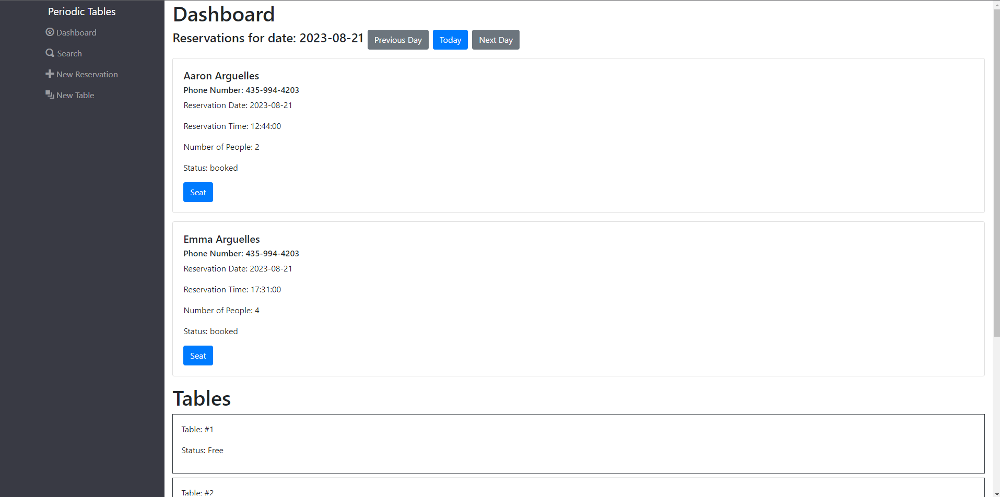
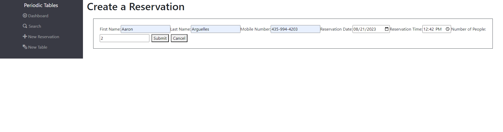
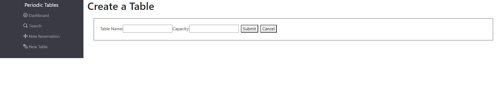

# Restaurant Reservations

The deployed application can be accessed here:

## Description

Restaurant Reservations is a full-stack application which allows the user to create and manage reservations for their restaurant. The user is meant to be the restaurant manager or staff.

You can view the reservations for each day, as well as search by phone number, and assign a reservation to a specific table they will be at. A reservation can also be edited or canceled. Along with creating new reservations, new tables can be created as well.

Dashboard:


Create a Reservation:


Create a Table:


## API Documentation

#### `GET /api/reservations`

**Description**: Fetches a list of all reservations.

**Response**:

```json
{
  "data": [
    {
      "first_name": "Rick",
      "last_name": "Sanchez",
      "mobile_number": "202-555-0164",
      "reservation_date": "2020-12-31",
      "reservation_time": "20:00:00",
      "people": 6,
      "status": "booked",
      "created_at": "2020-12-10T08:30:32.326Z",
      "updated_at": "2020-12-10T08:30:32.326Z"
    },
    {
      "first_name": "Frank",
      "last_name": "Palicky",
      "mobile_number": "202-555-0153",
      "reservation_date": "2020-12-30",
      "reservation_time": "20:00",
      "people": 1,
      "status": "booked",
      "created_at": "2020-12-10T08:31:32.326Z",
      "updated_at": "2020-12-10T08:31:32.326Z"
    },
    {
      "first_name": "Bird",
      "last_name": "Person",
      "mobile_number": "808-555-0141",
      "reservation_date": "2020-12-30",
      "reservation_time": "18:00",
      "people": 1,
      "status": "booked",
      "created_at": "2020-12-10T08:31:32.326Z",
      "updated_at": "2020-12-10T08:31:32.326Z"
    },
    {
      "first_name": "Tiger",
      "last_name": "Lion",
      "mobile_number": "808-555-0140",
      "reservation_date": "2025-12-30",
      "reservation_time": "18:00",
      "people": 3,
      "status": "booked",
      "created_at": "2020-12-10T08:31:32.326Z",
      "updated_at": "2020-12-10T08:31:32.326Z"
    },
    {
      "first_name": "Anthony",
      "last_name": "Charboneau",
      "mobile_number": "620-646-8897",
      "reservation_date": "2026-12-30",
      "reservation_time": "18:00",
      "people": 2,
      "status": "booked",
      "created_at": "2020-12-10T08:31:32.326Z",
      "updated_at": "2020-12-10T08:31:32.326Z"
    }
  ]
}
```

## Tech Stack

**Client:** React, JavaScript, CSS, Bootstrap

**Server:** Node, Express, Knex, PostgreSQL

## Installation

Install with npm

```bash
  npm install
```
